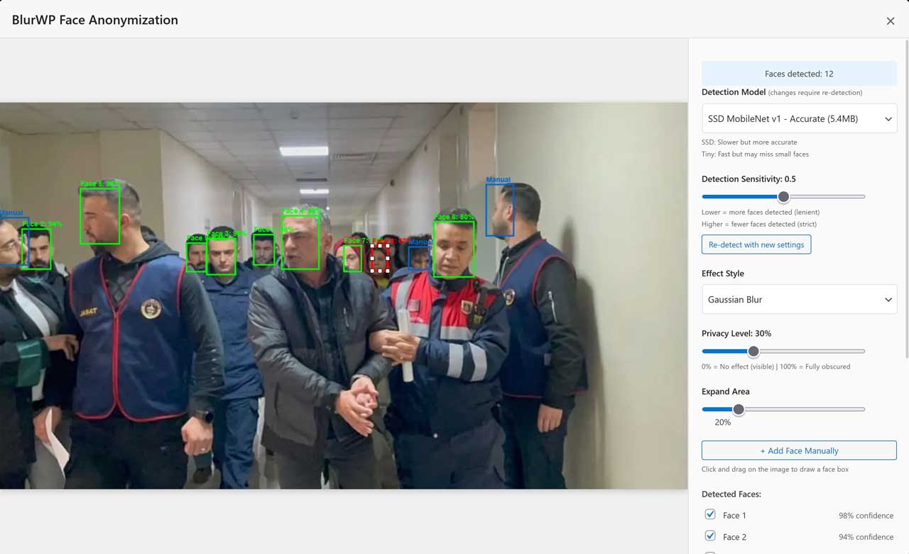
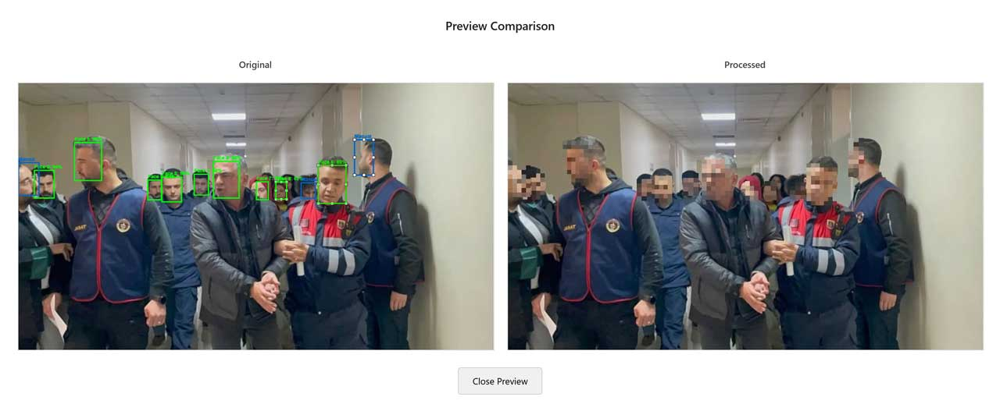
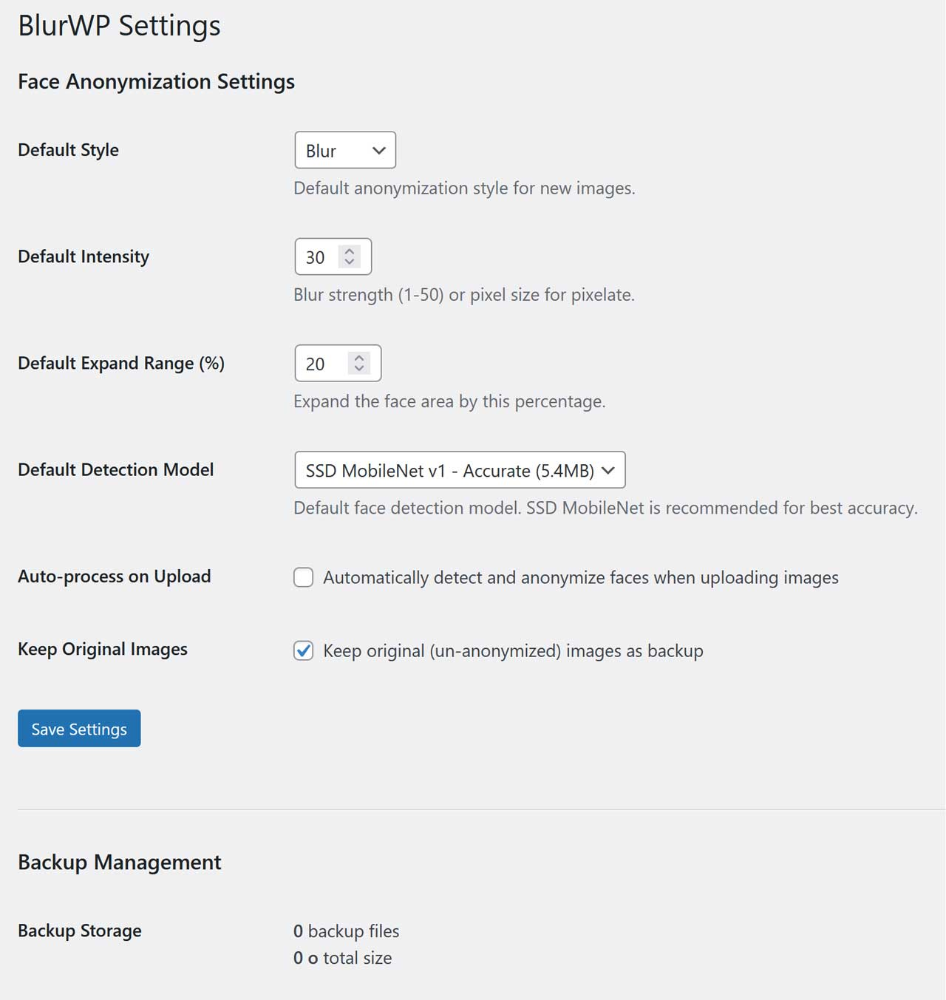

# BlurWP - Privacy-Focused Face Anonymization for WordPress

[](https://wordpress.org/)
[]()

> **Privacy-first face detection and anonymization plugin for WordPress**

BlurWP automatically detects faces in your WordPress media library images and allows you to blur or pixelate them to protect privacy. Built with modern web technologies and designed for ease of use.

## ✨ Features

### 🔒 Privacy Protection
- **Automatic Face Detection** - Uses machine learning to detect faces in images
- **Multiple Detection Models** - Choose between speed (Tiny Face Detector) or accuracy (SSD MobileNet v1)
- **Two Anonymization Styles** - Gaussian blur or pixelate effects
- **Adjustable Privacy Levels** - Fine-tune blur/pixelate intensity from 0-100%
- **Expand Function** - Expand detection boxes to ensure complete face coverage

### 🎨 User Interface
- **Intuitive Visual Editor** - See faces detected with bounding boxes
- **Interactive Face Boxes** - Drag to move, resize with handles
- **Manual Face Addition** - Draw boxes where auto-detection misses
- **Face Toggling** - Enable/disable individual faces
- **Reset Functionality** - Restore faces to original detected positions
- **Live Preview** - See results before saving

### 💾 Data Safety
- **Opt-In Backups** - Optional backup system (disabled by default)
- **Secure Storage** - Randomized backup filenames for security
- **Centralized Backups** - All backups in single protected folder
- **One-Click Restore** - Easy restoration from backups

### ⚡ Performance
- **Local Processing** - No external API calls or CDNs
- **Single Bundle** - One optimized JavaScript file (~670KB)
- **Lazy Model Loading** - Models load on-demand
- **Workspace Persistence** - Auto-saves work to sessionStorage

## 📸 Screenshots





## 📋 Requirements

- **WordPress**: 5.8 or higher
- **PHP**: 7.4 or higher
- **Modern Browser**: Chrome, Firefox, Safari, Edge (last 2 versions)
- **HTTPS**: Required for camera features (if used in future)

## 🚀 Installation

### Method 1: WordPress Admin
1. Download the latest release from GitHub
2. Go to **Plugins > Add New > Upload Plugin**
3. Upload `blurwp.zip`
4. Click **Install Now**
5. Click **Activate Plugin**

### Method 2: FTP/SFTP
1. Download and extract `blurwp.zip`
2. Upload the `blurwp` folder to `/wp-content/plugins/`
3. Go to **Plugins** in WordPress admin
4. Click **Activate** under BlurWP

### Method 3: WP-CLI
```bash
wp plugin install blurwp.zip --activate
```

## 📖 Usage

### Basic Usage

1. **Navigate to Media Library**
   - Go to **Media > Library** in WordPress admin

2. **Select an Image**
   - Click on any image that contains faces

3. **Open Face Editor**
   - Click the **"Blur Faces"** button that appears

4. **Review Detections**
   - The editor will automatically detect faces
   - Green boxes show detected faces
   - Blue boxes show manually added faces

5. **Adjust Settings**
   - **Style**: Choose Blur or Pixelate
   - **Privacy Level**: 0% (visible) to 100% (fully obscured)
   - **Expand**: Increase box size around faces

6. **Fine-Tune Faces**
   - Click a face box to select it
   - Drag to move the box
   - Drag handles (corners/edges) to resize
   - Use checkboxes to enable/disable faces

7. **Apply and Save**
   - Click **"Apply Effect"** to preview
   - Click **"💾 Save to WordPress"** to save
   - Confirm the warning dialog

### Advanced Features

#### Changing Detection Model
1. Open the face editor
2. Select from the **Model** dropdown:
   - **Tiny Face Detector** (189KB) - Fast, good for mobile
   - **SSD MobileNet v1** (5.4MB) - More accurate, better for desktop
   - **MTCNN** (1.9MB) - Alternative detection method

#### Adjusting Detection Sensitivity
1. Use the **Sensitivity** slider (0.1 - 0.9)
   - Lower values (0.1-0.3): Detect more faces, more false positives
   - Higher values (0.7-0.9): Fewer faces, more accurate

#### Adding Faces Manually
1. Click **"+ Add Face Manually"** button
2. Cursor changes to crosshair
3. Click and drag on image to draw a face box
4. New face appears in the list

#### Using Backups
1. Go to **Settings > BlurWP**
2. Enable **"Create backups before anonymizing"**
3. When saving, originals are backed up automatically
4. Use **"Restore"** link in Media Library to revert

## ⚙️ Configuration

### Settings Page
Navigate to **Settings > BlurWP** to configure:

- **Default Detection Model**: Choose which model loads by default
- **Backup System**: Enable/disable automatic backups
- **Storage Usage**: See how much space backups use
- **Purge Backups**: Delete all backups with one click

### Code Hooks

#### PHP Actions
```php
// Run after image is anonymized
do_action('blurwp_after_anonymize', $attachment_id, $metadata);

// Run after image is restored
do_action('blurwp_after_restore', $attachment_id, $backup_path);
```

#### PHP Filters
```php
// Modify blur intensity before applying
add_filter('blurwp_blur_intensity', function($intensity, $attachment_id) {
    return min(80, $intensity); // Cap at 80%
}, 10, 2);

// Modify detection options
add_filter('blurwp_detection_options', function($options) {
    $options['scoreThreshold'] = 0.6;
    return $options;
});
```

## 🔧 Troubleshooting

### Common Issues

#### "No faces detected"
- Try different detection model (SSD MobileNet v1 is more accurate)
- Lower the sensitivity threshold
- Manually draw face boxes
- Ensure faces are clearly visible and front-facing

#### "Image doesn't update after saving"
- Hard refresh the page (Ctrl+F5 or Cmd+Shift+R)
- Clear browser cache
- Check that the save completed successfully

#### "Models fail to load"
- Check browser console for errors
- Verify HTTPS is enabled
- Check file permissions on `assets/models/` folder
- Try a different browser

#### "Out of memory errors"
- Use Tiny Face Detector model (smaller memory footprint)
- Process smaller images first
- Increase PHP memory limit

### Debug Mode
Enable WordPress debug mode to see detailed logs:
```php
// Add to wp-config.php
define('WP_DEBUG', true);
define('WP_DEBUG_LOG', true);
define('WP_DEBUG_DISPLAY', false);
```

## 🙏 Acknowledgments

- **face-api.js** - Face detection library by [justadudewhohacks](https://github.com/justadudewhohacks/face-api.js)
- **TensorFlow.js** - Machine learning framework
- **WordPress** - Content management system

---

**Made with ❤️ for privacy-conscious WordPress users**
